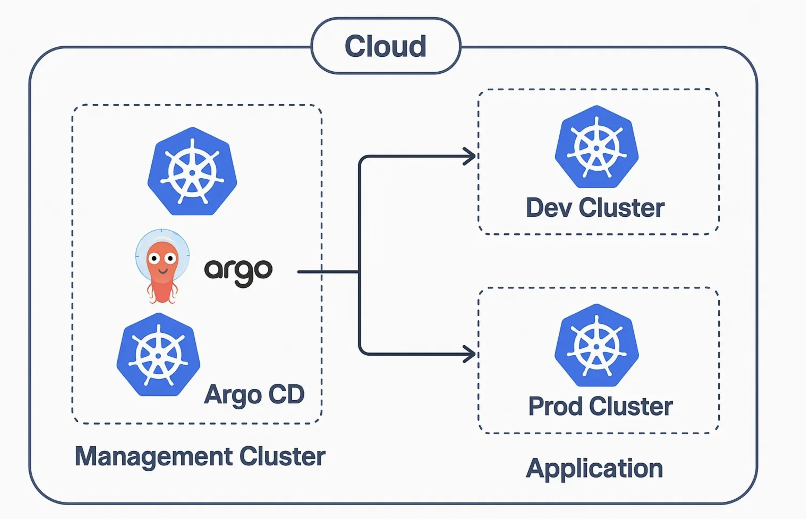

Many organizations running workloads in Kubernetes are embracing ArgoCD to deploy safely and ensure consistency and traceability.

Unfortunately there are not many guidelines or best practices yet explaining how to structure the GitOps repository for simplicity and maintainability.

In this article I would like to show my solution with a setup consisting of a single management ArgoCD instance. It allows a clear separation between applications, infrastructure and ArgoCD Apps and Projects. Moreover it supports multiple environments by leveraging Kustomize.

Source repo: [https://github.com/paolocarta/gitops-argocd-repo-structure](https://github.com/paolocarta/gitops-argocd-repo-structure)

**Tech used:**
- Kubernetes
- ArgoCD
- Kustomize

Architecture with a single management instance:



## Structure

The main idea is to have one folder (`apps`) where we specify custom applications developed by our dev teams. Another folder (`infrastructure`) is where DevOps engineers will work, deploying infrastructure and middleware to our clusters. Finally, we need a folder (`argocd`) to instruct the single ArgoCD instance about what to deploy and where.

To recap, we have 3 main folders:

- `apps` — Custom apps developed by dev teams
- `argocd` — ArgoCD Application custom resources
- `infrastructure` — All middleware deployed by Ops

High level structure:

```
➜  gitops-repo git:(main) tree
.
│
├── apps
│   ├── another-app/
│   └── flask-app/
│
├── argocd
│   ├── app-projects/
│   ├── applications
│   │   ├── apps/
│   │   └── infrastructure/
│   └── bootstrap
│       └── root-app.yaml
│
├── infrastructure
│   ├── databases
│   │   └── postgres/
│   └── message-brokers
│       └── rabbitmq/
```

The structure leverages Kustomize and its overlays for defining multiple environments and avoiding duplication.

Detailed structure:

```
➜  gitops-repo git:(main) tree
.
│
├── apps
│   ├── another-app
│   │   ├── base
│   │   │   ├── deployment.yaml
│   │   │   ├── kustomization.yaml
│   │   │   └── service.yaml
│   │   └── overlays
│   │       ├── dev
│   │       │   └── kustomization.yaml
│   │       └── prod
│   │           └── kustomization.yaml
│   └── flask-app
│       ├── base
│       │   ├── deployment.yaml
│       │   ├── kustomization.yaml
│       │   └── service.yaml
│       └── overlays
│           ├── dev
│           │   ├── deployment.yaml
│           │   └── kustomization.yaml
│           └── prod
│               ├── deployment.yaml
│               └── kustomization.yaml
│
├── argocd
│   ├── app-projects
│   │   ├── apps.yaml
│   │   ├── brokers.yaml
│   │   ├── databases.yaml
│   │   └── system.yaml
│   ├── applications
│   │   ├── apps
│   │   │   ├── external
│   │   │   │   └── external-repo-app-of-apps.yaml
│   │   │   └── internal
│   │   │       ├── another-app-appset.yaml
│   │   │       └── flask-app-appset.yaml
│   │   └── infrastructure
│   │       ├── dev
│   │       │   ├── postgres.yaml
│   │       │   └── rabbitmq.yaml
│   │       └── prod
│   │           ├── postgres.yaml
│   │           └── rabbitmq.yaml
│   └── bootstrap
│       └── root-app.yaml
│
├── infrastructure
│   ├── databases
│   │   └── postgres
│   │       ├── base
│   │       │   ├── kustomization.yaml
│   │       │   ├── service.yaml
│   │       │   └── statefulset.yaml
│   │       └── overlays
│   │           ├── dev
│   │           │   └── kustomization.yaml
│   │           └── prod
│   │               └── kustomization.yaml
│   └── message-brokers
│       └── rabbitmq
│           ├── base
│           │   ├── deployment.yaml
│           │   ├── kustomization.yaml
│           │   └── service.yaml
│           └── overlays
│               ├── dev
│               │   └── kustomization.yaml
│               └── prod
│                   └── kustomization.yaml
├── tools
│   ├── generate-secrets.sh
│   ├── validate-argocd.sh
│   └── validate-kustomize.sh
```

## Infrastructure Folder

This folder holds manifests for all infrastructure and middleware, for instance:

- Databases
- Message Brokers
- Caches
- Monitoring
- Logging
- Others

```
│
├── infrastructure
│   ├── databases
│   │   └── postgres
│   │       ├── base
│   │       │   ├── kustomization.yaml
│   │       │   ├── service.yaml
│   │       │   └── statefulset.yaml
│   │       └── overlays
│   │           ├── dev
│   │           │   └── kustomization.yaml
│   │           └── prod
│   │               └── kustomization.yaml
│   └── message-brokers
│       └── rabbitmq/
```

In the example we define a PostgreSQL Database and a RabbitMQ Broker. The middleware is deployed to a `dev` and `prod` environment. Each folder will be referenced by an ArgoCD application.

Each infrastructure component is defined using Kustomize. A `base` layer holds common configuration. Each overlay can specify things which are environment specific.

## Apps Folder

The `apps` folder represents custom applications developed by dev teams. Each application is a collection of classic Kubernetes manifests such as Deployments, Services, ConfigMaps and so on.

Each application leverages Kustomize with a `base` layer and overlays for each environment. An ArgoCD Application will reference each overlay.

In the example we define two apps:

- Flask Dummy App
- Another Dummy App

```
│
├── apps
│   ├── another-app/
│   └── flask-app
│       ├── base
│       │   ├── deployment.yaml
│       │   ├── kustomization.yaml
│       │   └── service.yaml
│       └── overlays
│           ├── dev
│           │   ├── deployment.yaml
│           │   └── kustomization.yaml
│           └── prod
│               ├── deployment.yaml
│               └── kustomization.yaml
```

This folder could be extracted to separate repositories, depending on your company and team structure.

## ArgoCD Folder

This folder defines all ArgoCD Applications and AppProjects. All of them are deployed to the single ArgoCD management instance.

The first Application is the App of Apps: `bootstrap/root-app.yaml`. This is the application at the root of the tree hierarchy — it points to all other Applications defined. A reference to this app can be used where ArgoCD is actually installed. For instance, if ArgoCD is installed via Terraform, this Application can be applied to bootstrap the entire system.

The `applications` folder is divided by category: normal apps and infrastructure apps. This separation makes it clear which ArgoCD Applications manage custom services and which manage infrastructure middleware.

```
├── argocd
│   ├── app-projects
│   │   ├── apps.yaml
│   │   ├── brokers.yaml
│   │   ├── databases.yaml
│   │   └── system.yaml
│   ├── applications
│   │   ├── apps
│   │   │   ├── external
│   │   │   │   └── external-repo-app-of-apps.yaml
│   │   │   └── internal
│   │   │       ├── another-app-appset.yaml
│   │   │       └── flask-app-appset.yaml
│   │   └── infrastructure
│   │       ├── dev
│   │       │   ├── postgres.yaml
│   │       │   └── rabbitmq.yaml
│   │       └── prod
│   │           ├── postgres.yaml
│   │           └── rabbitmq.yaml
│   └── bootstrap
│       └── root-app.yaml
```

Finally, the `app-projects` folder holds ArgoCD AppProjects, which are used to categorize and group applications while also defining allowed source repositories and destination clusters.

## Conclusions

A starting structure like this can be very beneficial for projects leveraging ArgoCD to deploy to Kubernetes. It allows you to clearly identify application manifests, infrastructure manifests, and ArgoCD configuration in terms of Applications and AppProjects.

Source repo: [https://github.com/paolocarta/gitops-argocd-repo-structure](https://github.com/paolocarta/gitops-argocd-repo-structure)
