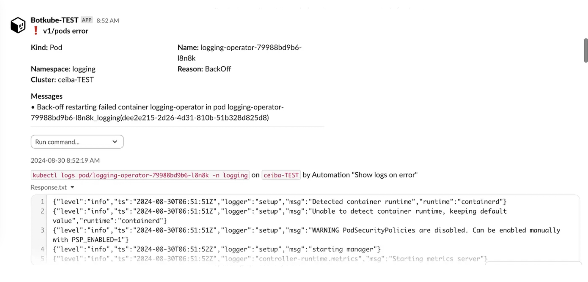
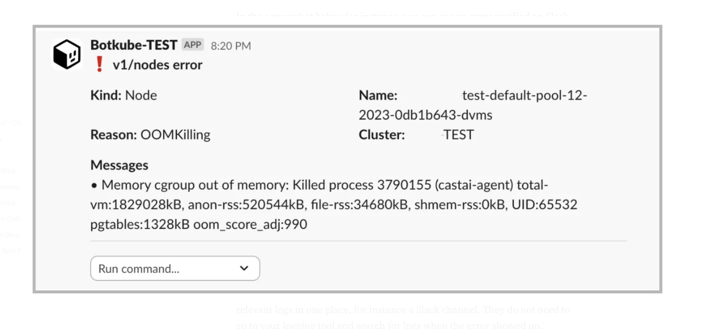
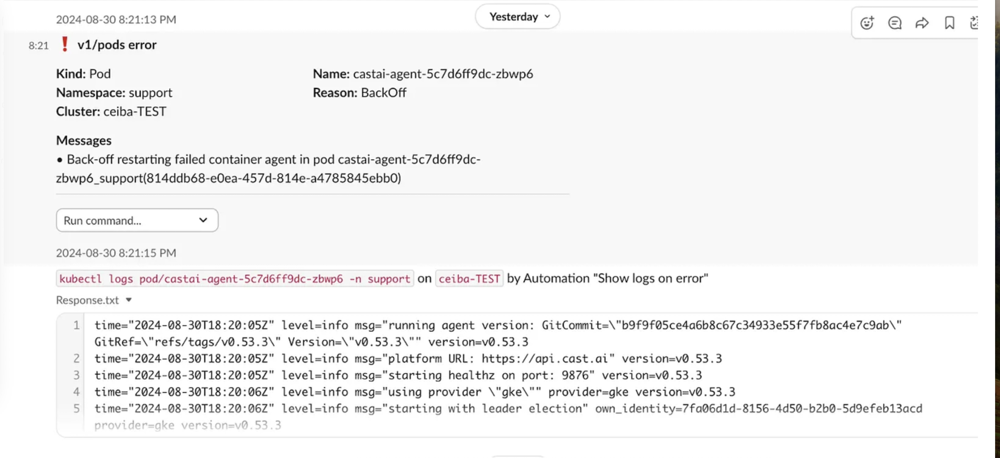

## Prerequisites
In order to use this guide, I assume you already have:

- A Kubernetes Cluster up and running
- [Botkube](https://docs.botkube.io/installation/slack/#install-botkube-in-kubernetes-cluster) installed on your cluster
- [Slack App](https://docs.botkube.io/installation/slack/#install-app-for-socket-slack-in-your-slack-workspace) for Botkube installed in your workspace

In case you don't fullfill all of them, please follow the links attached for the setup.

## Classic Notifications
Imagine you're managing a Kubernetes cluster and want to keep an eye on any errors occurring in your apps. With [Botkube](https://botkube.io/), we can get chat notifications about issues detected from Kubernetes events. This approach improves the platform team's reaction time quite a bit.

In the screenshot below for instance, you can see an error notified on Slack due to an OutOfMemory issue:



## Meet Botkube Actions
Necessary terminology:

- **Botkube Executor**: An executor is basically a shell binary you can call to perform some action. For instance, kubectl, helm, etc.
- **Botkube Event Source**: It represents the source of events, producing information that needs to be notified. It could be for instance specific events created by a Pod in a namespace.

Notifications are really useful whenever an error occurs, however we can improve it by also executing some action whenever something happens, for instance getting useful logs from the timeframe when the error occurred. This approach simplifies and speeds up troubleshooting done by platform teams. In fact, they are not only notified of an error, but they also see the relevant logs in one place, for instance a Slack channel. They do not need to go to your logging tool and search for logs when the error showed up.

We can achieve this behavior by using Botkube's [Actions](https://docs.botkube.io/features/actions/), which are available in its recent versions. Actions allow basically to execute shell commands whenever an event has occurred. Actions allow to bind an event source to an executor that performs some task, for instance fetching logs and sending them to your Slack channel.

## Actions Configuration
The configuration can be created in the global-config configmap if you are using the default structure. There you can add event sources, executors and actions.

Since the configmap is quite big and needs proper indentation and formatting, I suggest using Kustomize to generate it. It allows the creation of a plain YAML file for the Botkube config, which can be then used to generate a regular Kubernetes configmap.

Example of the kustomization file needed to generate the configmap:

```yaml
apiVersion: kustomize.config.k8s.io/v1beta1
kind: Kustomization


generatorOptions:
 disableNameSuffixHash: true


configMapGenerator:
 - name: botkube-global-config
   files:
     - global_config.yaml
```

Let's inspect step by step the relevant sections we need to have in the global-config configMap. First we create an executor, which executes some task using the kubectl plugin. Additionally we can configure what is allowed to be called from our chat under the interactive builder section.

```yaml
# global_config.yaml

executors:
 k8s-tools:
   botkube/kubectl:
     enabled: true
     displayName: Kubectl
     config:
       defaultNamespace: monitoring
       interactiveBuilder:
         allowed:
           namespaces:
             - bak
             - ingress
             - logging
             - monitoring
             - networking
             - support
           verbs:
             - describe
             - get
             - logs
           resources:
             - pods
             - deployments
             - statefulsets
             - daemonsets
             - services


     context:
       rbac:
         group:
           type: Static
           prefix: ""
           static:
             values:
               - botkube-exec-kubectl
```

The next snippet from the global-config configMap shows an event source, which is what we want to notify in our chat based on Kubernetes events. We need to use the kubernetes plugin and configure how we want to filter and classify events.

In the following configuration we are interested in events which can be classified as errors from all namespaces except from the kube-system. Additionally we define which resources we want to get notifications from, for instance, Pods, Deployments, StatefulSets and DaemonSets.

```yaml
# global_config.yaml

sources:
 platform-team-err:
   displayName: Errors with resources logs
   botkube/kubernetes:
     enabled: true
     context:
       rbac:
         group:
           prefix: ""
           type: Static
           static:
             values:
               - botkube-src-kubernetes
     config:
       filters:
         objectAnnotationChecker: true
         nodeEventsChecker: true
       event:
         types:
           - error
         reason:
           include:
             - .*
       namespaces:
         include:
           - .*
         exclude:
           - kube-.*

       resources:
         - type: v1/pods
         - type: apps/v1/deployments
         - type: apps/v1/statefulsets
         - type: apps/v1/daemonsets
         - type: batch/v1/jobs
```

Finally we can define an action, binding the executor, the kubectl, with the event source we defined previously. Every time an event is produced by our platform-team-err source, the executor k8s-tools is called. The command executed is kubectl logs with a few parameters.

```yaml
actions:
 show-logs-on-error:
   enabled: true
   displayName: Show logs on error
   command: kubectl logs {{ .Event.Kind | lower }}/{{ .Event.Name }} -n {{ .Event.Namespace }}
   bindings:
     executors:
       - k8s-tools
     sources:
      - platform-team-err
```

For instance, the pictures below show some errors in infrastructure applications which are coming from Kubernetes's events. In addition we can also see the logs when such an error occurred:

First:



Second:



Logs obtained this way can provide a quick overview of the problem, speeding up recovery time.

## Route Notifications to Slack
The final important piece of configuration is needed to route notifications to our Slack channels. It is configured in a Secret called communication, which specifies the chat platform, in this case Slack, together with the required credentials for the Slack app and information about the channels.

In this case, we notify in the channel called alerts-platform-team and we bind both the event source and the executor to this channel.

```yaml
apiVersion: v1
kind: Secret
metadata:
 name: botkube-communication
stringData:
 comm_config.yaml: |
   communications:
     slack-platform-alerts:
       socketSlack:
         enabled: true
         # APP: Botkube - METHOD: Socket mode
         botToken: some-bot-token
         appToken: some-app-token
         channels:
           alerts-platform-team:
             name: alerts-platform-team
             bindings:
               sources: 
                 - platform-team-err
               executors:
                 - k8s-tools
```
