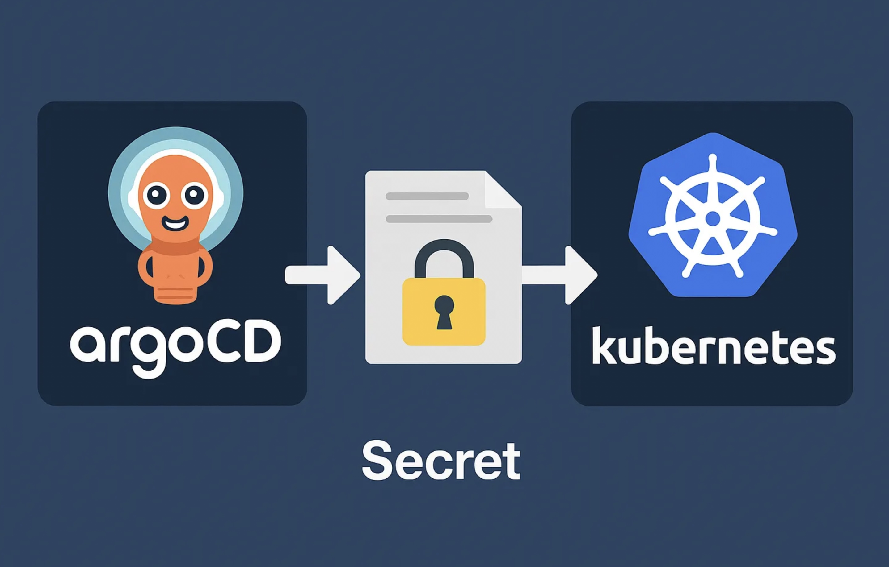

This article focuses on using SOPS-encrypted secrets with Argo CD when your Kubernetes manifests are managed by kustomize. One of the most common patterns is to use the [ksops](https://github.com/viaduct-ai/kustomize-sops) plugin, which lets kustomize decrypt your SOPS-encrypted YAML files at build time so Argo CD can apply the resulting manifests.

If you are not familiar with SOPS, have a look at my [previous article](../sops-gitops-secrets/) first.



## Overview of the Flow

1. You keep your Kubernetes manifests in Git, including your SOPS-encrypted secrets.
2. You configure kustomize to use the ksops plugin to decrypt those secrets on the fly.
3. Argo CD pulls from your Git repo, runs kustomize with the ksops plugin, and gets decrypted YAML.
4. Argo CD applies the final plaintext resources to the cluster.

Decryption happens just in time during the kustomize build phase — no plaintext secrets in Git, and none in Argo CD's history.

## Setup ksops in Your Git Repository

In the same directory as your `kustomization.yaml`, create a small plugin config referencing your SOPS-encrypted files:

```
my-kustomize-dir/
├─ kustomization.yaml
├─ secret.enc.yaml       # SOPS-encrypted secret
├─ ksops-config.yaml     # ksops plugin generator
└─ other-manifest.yaml
```

**kustomization.yaml**

```yaml
apiVersion: kustomize.config.k8s.io/v1beta1
kind: Kustomization

resources:
  - deployment.yaml
  - service.yaml

generators:
  - ksops-config.yaml
```

**ksops-config.yaml**

```yaml
apiVersion: viaduct.ai/v1
kind: ksops
metadata:
  name: ksops-config
files:
  - secret.enc.yaml
```

When kustomize runs with `--enable-alpha-plugins`, it reads `ksops-config.yaml`, loads the plugin, and decrypts `secret.enc.yaml` into a valid Kubernetes `Secret` manifest.

**`.sops.yaml` (optional but recommended)**

Define your key backend once so you don't have to specify it on every command:

```yaml
creation_rules:
  - kms: "arn:aws:kms:us-east-1:111122223333:key/1234abcd-12ab-34cd-56ef-1234567890ab"
    encrypted_regex: '^(data|stringData)$'
    path_regex: '.*-secret\.yaml$'
```

## Setup ksops in Argo CD

**Enable alpha plugins in `argocd-cm`**

```yaml
apiVersion: v1
kind: ConfigMap
metadata:
  name: argocd-cm
  namespace: argocd
data:
  kustomize.buildOptions: "--enable-alpha-plugins"
```

**Install ksops in the repo-server**

The snippet below shows the relevant additions to the `argocd-repo-server` Deployment. An init container copies the ksops and kustomize binaries into a shared volume that the main container then uses.

```yaml
apiVersion: apps/v1
kind: Deployment
metadata:
  name: argocd-repo-server
  namespace: argocd
spec:
  template:
    spec:
      initContainers:
        - name: install-ksops
          image: viaductoss/ksops:v4.3.1
          command: ["/bin/sh", "-c"]
          args:
            - echo "Installing KSOPS...";
              mv ksops /custom-tools/;
              mv kustomize /custom-tools/;
              echo "Done.";
          volumeMounts:
            - mountPath: /custom-tools
              name: custom-tools
        - name: import-gpg-key
          image: quay.io/argoproj/argocd:v2.14.15
          command: ["gpg", "--import", "/sops-gpg/ci.asc"]
          env:
            - name: GNUPGHOME
              value: /gnupg-home/.gnupg
          volumeMounts:
            - mountPath: /sops-gpg
              name: sops-gpg
            - mountPath: /gnupg-home
              name: gnupg-home
      containers:
        - name: argocd-repo-server
          env:
            - name: XDG_CONFIG_HOME
              value: /.config
            - name: GNUPGHOME
              value: /home/argocd/.gnupg
          volumeMounts:
            - mountPath: /home/argocd/.gnupg
              name: gnupg-home
              subPath: .gnupg
            - mountPath: /usr/local/bin/kustomize
              name: custom-tools
              subPath: kustomize
            - mountPath: /usr/local/bin/ksops
              name: custom-tools
              subPath: ksops
      volumes:
        - name: custom-tools
          emptyDir: {}
        - name: gnupg-home
          emptyDir: {}
        - name: sops-gpg
          secret:
            secretName: sops-gpg-key
```

## Provide SOPS Credentials to Argo CD

The repo-server pod must have access to the decryption keys. Common approaches:

- **AWS KMS**: Annotate the repo-server's service account with an IAM role that has `kms:Decrypt` permissions (IRSA), or inject `AWS_ACCESS_KEY_ID` / `AWS_SECRET_ACCESS_KEY` as environment variables.
- **GPG**: Mount your GPG key from a Kubernetes Secret and point `GNUPGHOME` at it (as shown in the Deployment above).
- **Vault**: Provide `VAULT_ADDR` and a token (or use Kubernetes auth). SOPS calls the Vault Transit engine for decryption.

Without the correct credentials, the kustomize build step in Argo CD will fail.

## Summary

1. Encrypt your secret with SOPS.
2. Reference it in a `ksops-config.yaml` generator so kustomize decrypts it at build time.
3. Enable alpha plugins in Argo CD via `argocd-cm`.
4. Install the ksops plugin in the Argo CD repo-server using an init container.
5. Provide the necessary SOPS keys or credentials to the repo-server (IAM role, GPG key, Vault token).

With this setup, secrets stay encrypted in Git while Argo CD decrypts them dynamically and deploys your applications.
